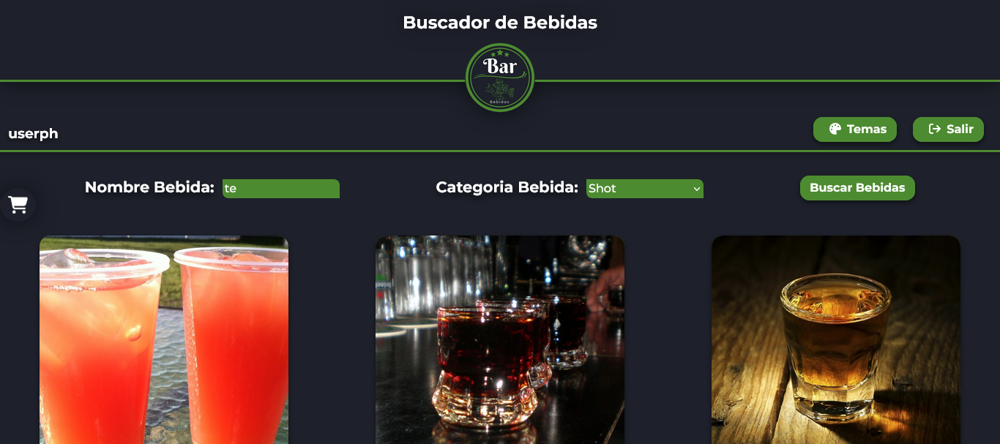

# Formar - Drinks

Solución a un proyecto de bebidas como parte de la formación en React de la fundación Formar.

## Table of contents

- [Overview](#overview)
  - [The challenge](#the-challenge)
  - [Screenshot](#screenshot)
  - [Links](#links)
  - [Built with](#built-with)
  - [Useful resources](#useful-resources)
- [Author](#author)

## Overview

### The challenge

Los usuarios deben ser capaces de:

- Realizar búsqueda por nombre y categoría.
- Visualizar la lista de bebidas y al cliquear una poder acceder a la receta.

### Screenshot

### Links

- Solution URL: [GitHub](https://github.com/BarrosLucasJavier/drinks-proyect)
- Live Site URL: [Deploy](https://drinks-proyect.vercel.app/)

### Built with

- Semantic HTML5 markup
- CSS custom properties
- Flexbox
- Mobile-first workflow
- [React](https://reactjs.org/) - JS library
- [Vite](https://vitejs.dev/)

### Useful resources

- [Refuerzo de conceptos](https://developer.mozilla.org/en-US/) - Me ayudo con la estructura de ciertas propiedades de css.
- [React ](https://es.react.dev/learn) - Repaso de Hooks.
- [The Cocktail Db](https://www.thecocktaildb.com/api.php) - Api de bebidas.

## Author

- GitHub - [Barros Lucas Javier](https://github.com/BarrosLucasJavier)
- Linkedin - [Lucas Javier Barros](https://www.linkedin.com/in/barroslucasjavier/)